Faceți un screenshot cu râspunsurile voastre și ofețil lui chatGPT cu prompt-ul scris aici, analizați detaliat sugestiile primite, mai ales dacă au fost detectate ceva greșeli.

# Modulul 1

## Exercițiul 1:

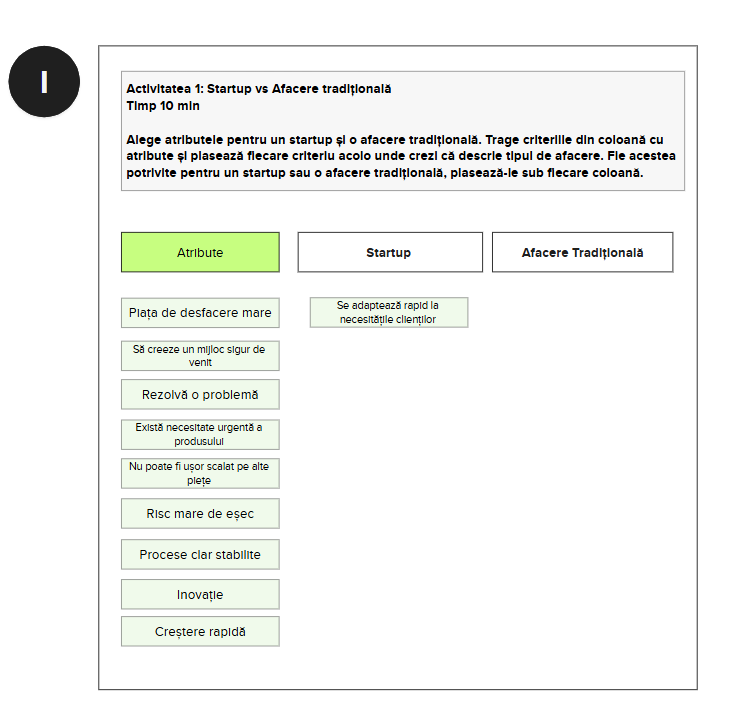


Prompt:
```
Am un exercițiu în care trebuie să clasific niște atribute ca aparținând unui startup sau unei afaceri tradiționale.
Îți voi oferi:

Clasificarea corectă (pe care trebuie să o folosești ca referință)
Răspunsul meu

Te rog să compari răspunsul elevului cu clasificarea corectă și să îmi spui:
Ce a fost clasificat corect
Ce a fost greșit clasificat
Ce explicații ai da pentru greșelile comise

Clasificare corectă:
Startup:

Rezolvă o problemă
Creștere rapidă
Risc mare de eșec
Inovație
Se adaptează rapid la nevoile clienților
Există necesitate urgentă a produsului

Afacere tradițională:

Nu poate fi ușor scalat pe alte piețe
Piață de desfacere mare
Să creeze un mijloc sigur de venit
Procese clar stabilite


Te rog analizează și oferă feedback.
```

## Exercițiul 2:

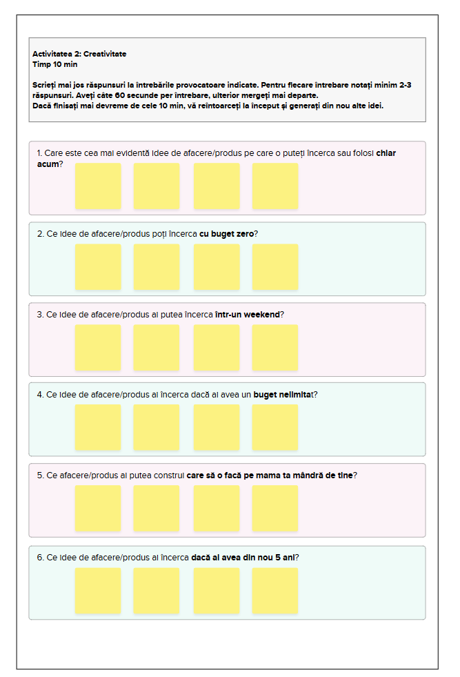


Prompt:
```
Am completat un exercițiu de creativitate unde trebuia să răspund la 6 întrebări legate de idei de afaceri. La fiecare întrebare am scris câteva idei, iar acum vreau să știu dacă răspunsurile mele sunt bune.
Îți dau mai jos cele 6 întrebări și răspunsurile mele, iar tu te rog:
Să îmi spui dacă ideile mele sunt corecte, realiste și creative
Unde am dat idei slabe sau incomplete, să-mi spui cum le-aș putea îmbunătăți
Dacă ai și alte sugestii mai bune, mi-ar plăcea să le aflu

Întrebările:
Care este cea mai evidentă idee de afacere/produs pe care o poți încerca sau folosi chiar acum?

Ce idee de afacere/produs poți încerca cu buget zero?
Ce idee de afacere/produs ai putea încerca într-un weekend?
Ce idee de afacere/produs ai încerca dacă ai avea un buget nelimitat?
Ce afacere/produs ai putea construi care să o facă pe mama ta mândră de tine?
Ce idee de afacere/produs ai încerca dacă ai avea din nou 5 ani?

Răspunsurile mele sunt:
(aici inserez ideile din imagine sau scrise manual, câte 2-3 la fiecare întrebare)
Te rog analizează-le și dă-mi un feedback sincer. Vreau să știu ce am făcut bine și ce pot face mai bine.
```

## Exercițiul 3: Definirea Problemei (ODD - Pasul d)

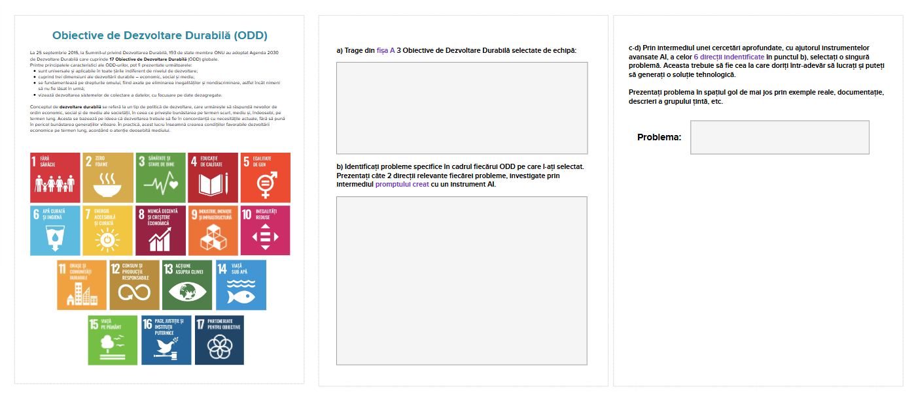 

Prompt:
```
Am finalizat un exercițiu în care am cercetat mai multe probleme legate de Obiectivele de Dezvoltare Durabilă (ODD), pornind de la 3 ODD-uri selectate, identificând 6 direcții de cercetare, și în final am ales o singură problemă specifică pe care doresc să o abordez și să o prezint detaliat.

Îți voi oferi:
Prezentarea problemei pe care am ales-o (textul din câmpul "Problema:")

Te rog să evaluezi prezentarea problemei mele pe baza următoarelor criterii, conform cerințelor din pasul (d) al exercițiului:

Criterii de evaluare:
1.  **Claritatea și Specificitatea Problemei:** Este problema definită clar, concis și suficient de specific? Se înțelege exact ce dificultate sau nevoie se adresează?
2.  **Relevanța față de ODD:** Reiese clar legătura dintre problema prezentată și unul sau mai multe ODD-uri (chiar dacă nu sunt menționate explicit în textul final, contextul cercetării ar trebui să fie evident)?
3.  **Justificarea prin Elemente Concrete:** Prezentarea include elementele solicitate pentru a susține problema?
    *   Sunt oferite **exemple reale** care ilustrează problema?
    *   Se face referire la **documentație** sau date care să susțină existența/gravitatea problemei?
    *   Este descris **grupul țintă** afectat de problemă?
4.  **Potențial de Soluționare (Implicit):** Descrierea problemei sugerează că este o problemă la care s-ar putea lucra pentru a găsi o soluție (tehnologică sau de alt tip), așa cum se menționează în cerință?

Feedback-ul tău ar trebui să includă:
*   Ce aspecte ale prezentării problemei sunt bine realizate (clare, specifice, bine justificate).
*   Ce aspecte necesită îmbunătățiri (ex: definire mai clară, exemple mai concrete, descriere mai bună a grupului țintă, lipsa unor dovezi/documentație).
*   Sugestii specifice pentru a îmbunătăți descrierea problemei selectate.

Te rog analizează și oferă feedback constructiv.
```

# Modulul 2
## Exercițiul 1: Ideare

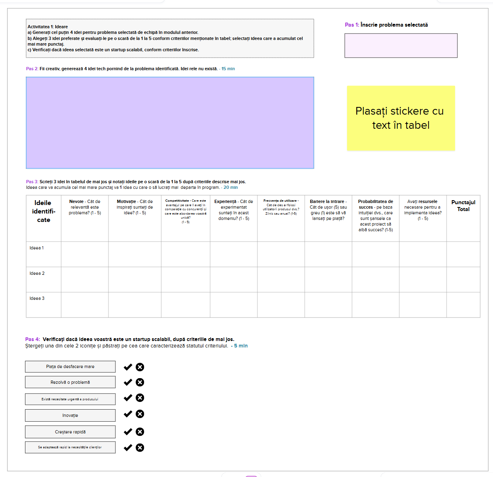

Prompt:
```
Am finalizat un exercițiu în care am generat idei pornind de la o problemă, am selectat 3 idei preferate și le-am evaluat într-un tabel pe o scară de la 1 la 5 conform unor criterii. Apoi, am verificat dacă ideea selectată (cea cu punctajul cel mai mare) este un startup scalabil, folosind o listă de caracteristici.

Îți voi oferi:
1.  **Tabelul completat (Pas 3):** Cu cele 3 idei și punctajele acordate pentru fiecare criteriu (Nevoie, Motivație, Competitivitate, Experiență, Frecvența de utilizare, Bariere la intrare, Probabilitatea de succes, Resurse necesare) și Punctajul Total calculat pentru fiecare idee.
2.  **Verificarea Startup Scalabil (Pas 4):** Lista de criterii unde am păstrat iconița (✔️ sau ❌) care caracterizează ideea mea selectată (cea cu punctajul cel mai mare din tabel).

Te rog să evaluezi munca mea și să îmi oferi feedback, verificând următoarele:

**Evaluare pentru Tabelul de Idei (Pas 3):**
1.  **Completitudine:**
    *   Sunt prezente 3 idei distincte?
    *   Au fost completate punctaje (între 1 și 5) pentru toate criteriile la toate cele 3 idei?
    *   A fost calculat Punctajul Total pentru fiecare idee?
2.  **Corectitudinea Calculului:** Este Punctajul Total suma corectă a punctajelor individuale pentru fiecare idee?
3.  **Selecția Ideii:** S-a identificat (implicit sau explicit) ideea cu cel mai mare punctaj total? (Aceasta este ideea evaluată la Pas 4).

**Evaluare pentru Verificarea Startup Scalabil (Pas 4):**
1.  **Completitudine:** A fost păstrată o singură iconiță (✔️ sau ❌) pentru fiecare criteriu din listă?
2.  **Corectitudinea Clasificării:** Compară selecțiile mele (iconițele păstrate) cu caracteristicile așteptate pentru un startup scalabil.

    *   **Caracteristici Așteptate pentru un Startup Scalabil (Folosește aceasta ca referință):**
        *   Piață de desfacere mare: ❌ (Startup-urile adesea încep pe o nișă)
        *   Rezolvă o problemă: ✔️ (Fundamental)
        *   Există necesitate urgentă a produsului: ✔️ (Indicator bun pentru adopție rapidă)
        *   Inovație: ✔️ (Diferențiator cheie)
        *   Creștere rapidă: ✔️ (Obiectiv definitoriu)
        *   Se adaptează rapid la necesitățile clienților: ✔️ (Agilitate necesară)

    *   Spune-mi care criterii le-am clasificat corect (am păstrat iconița corectă ✔️/❌ conform listei de mai sus) și care au fost clasificate greșit.

**Feedback General:**
*   Ce am făcut bine în ambele părți (Pas 3 și Pas 4).
*   Ce anume trebuie corectat sau îmbunătățit (ex: calcule greșite, criterii necompletate, clasificări incorecte la Pas 4).
*   Oferă scurte explicații pentru clasificările greșite de la Pas 4 (de ce un anumit criteriu este/nu este tipic pentru un startup scalabil).

Te rog analizează și oferă feedback constructiv.
```

## Exercițiul 2: Completarea Lean Canvas

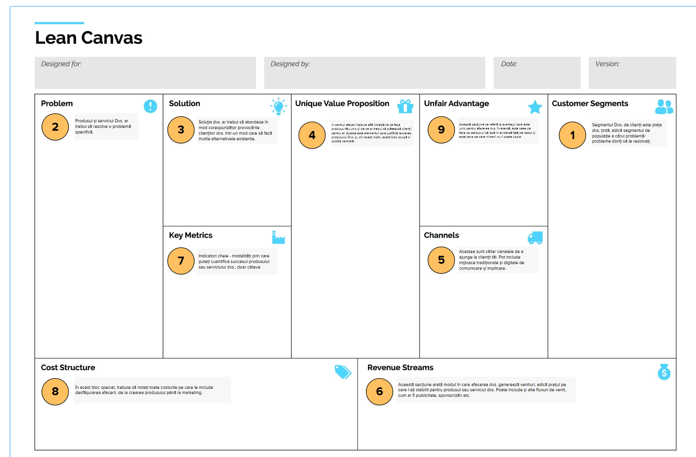

Prompt:
```
Am completat un Lean Canvas pentru ideea mea de afacere, umplând fiecare dintre cele 9 secțiuni conform cerințelor.

Îți voi oferi:
Conținutul pe care l-am scris în fiecare dintre cele 9 secțiuni ale Lean Canvas-ului:
1.  Segmente de Clienți
2.  Problemă (și alternative existente)
3.  Soluție
4.  Propunere Unică de Valoare (PUV)
5.  Canale
6.  Surse de Venit
7.  Structura Costurilor
8.  Indicatori Cheie
9.  Avantaj Neloial

Te rog să evaluezi Lean Canvas-ul meu completat și să îmi oferi feedback detaliat, verificând următoarele aspecte pentru fiecare secțiune și pentru canvas în ansamblu:

Criterii Generale de Evaluare:
1.  **Completitudine:** Sunt toate cele 9 secțiuni completate cu informații relevante?
2.  **Claritate și Specificitate:** Informațiile din fiecare secțiune sunt clare, concise și specifice ideii mele de afacere? (Evită generalitățile vagi).
3.  **Coerență:** Informațiile din diferitele secțiuni se leagă logic între ele? De exemplu:
    *   Soluția propusă adresează în mod direct Problemele identificate?
    *   Propunerea Unică de Valoare (PUV) rezonează cu Segmentele de Clienți și Problemele lor?
    *   Canalele alese sunt potrivite pentru a ajunge la Segmentele de Clienți definite?
    *   Indicatorii Cheie măsoară progresul către obiective relevante pentru modelul de afaceri?
    *   Există o legătură logică între Sursele de Venit și Structura Costurilor?
4.  **Înțelegerea Conceptelor:** Demonstrează conținutul fiecărei secțiuni o înțelegere corectă a scopului său?
    *   **Problemă:** Sunt problemele specifice și relevante pentru client? Sunt menționate alternativele pe care le folosesc clienții acum?
    *   **Segmente de Clienți:** Este publicul țintă bine definit? Sunt identificați "early adopters"?
    *   **Soluție:** Este fezabilă și direct legată de problemă?
    *   **PUV:** Este cu adevărat unică și valoroasă pentru client? Este clar formulată?
    *   **Canale:** Sunt căile de acces la client realiste și specifice?
    *   **Surse de Venit:** Este modelul de monetizare clar și plauzibil?
    *   **Structura Costurilor:** Sunt identificate costurile majore și sunt ele realiste?
    *   **Indicatori Cheie:** Sunt relevanți, măsurabili și acționabili? Sunt doar câțiva, cei mai importanți?
    *   **Avantaj Neloial:** Este ceva ce nu poate fi ușor copiat sau cumpărat de competitori?

Feedback-ul tău ar trebui să includă:
*   Ce secțiuni sunt bine completate (clare, specifice, coerente).
*   Ce secțiuni necesită îmbunătățiri, cu sugestii specifice pentru fiecare (ex: "Problema ar trebui să fie mai specifică", "PUV nu este suficient de clară", "Indicatorii Cheie sunt prea generali", "Acest avantaj nu este neapărat 'neloial'").
*   Observații despre coerența și logica generală a modelului de afaceri prezentat în canvas.

Te rog analizează și oferă feedback constructiv.
```

# Modulul 3
## Exercițiul 1: Definește segmentele de clienți și formulează ipoteza

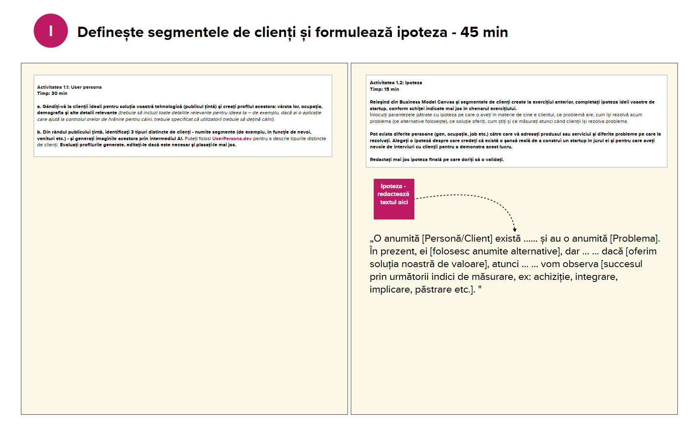

Prompt:
```
Am finalizat un exercițiu în două părți: prima în care am definit publicul țintă și am creat profiluri/segmente de clienți (Activitatea 1.1), și a doua în care am formulat o ipoteză specifică despre acești clienți, problemele lor și soluția mea, folosind un format dat (Activitatea 1.2).

Îți voi oferi:
1.  **Descrierea celor 3 segmente/tipuri distincte de clienți** pe care le-am identificat (conform cerinței b din Activitatea 1.1), incluzând detalii relevante (vârstă, ocupație, nevoi, venituri etc., așa cum sunt descrise în profilurile generate).
2.  **Ipoteza finală** pe care am redactat-o (conform cerinței din Activitatea 1.2), respectând structura dată.

Te rog să evaluezi munca mea pentru ambele activități și să îmi oferi feedback, verificând următoarele:

**Evaluare pentru Segmentele de Clienți (Activitatea 1.1):**
1.  **Relevanță:** Sunt segmentele de clienți relevante pentru ideea mea de afacere/soluția tehnologică propusă?
2.  **Detalii Esențiale:** Include descrierea fiecărui segment detaliile relevante solicitate (ex: demografie, ocupație, nevoi specifice legate de problemă)?
3.  **Distingere:** Sunt cele 3 tipuri de clienți suficient de *distincte* între ele (prezintă caracteristici, nevoi sau comportamente diferite)?
4.  **Claritate:** Sunt descrierile clare și ușor de înțeles?

**Evaluare pentru Formularea Ipotezei (Activitatea 1.2):**
1.  **Respectarea Formatului:** Am folosit corect structura dată pentru ipoteză? Sunt completate toate secțiunile dintre paranteze drepte `[ ]`?
    *   *Format Așteptat:* „O anumită [Personă/Client] există ...... și au o anumită [Problemă]. În prezent, ei [folosesc anumite alternative], dar ... ... ... dacă [oferim soluția noastră de valoare], atunci ... ... vom observa [succesul prin următorii indici de măsurare, ex: achiziție, integrare, implicare, păstrare etc.].”
2.  **Specificitate:** Sunt informațiile introduse în fiecare secțiune (Personă/Client, Problemă, Alternative, Soluție/Valoare, Indici de Măsurare) specifice și concrete?
3.  **Coerență:** Există o legătură logică între elementele ipotezei?
    *   Clientul menționat este unul dintre segmentele definite anterior?
    *   Problema este relevantă pentru acel client?
    *   Alternativele sunt realiste?
    *   Soluția propusă adresează problema?
    *   Indicii de măsurare sunt relevanți pentru a demonstra succesul soluției în rezolvarea problemei pentru acel client?
4.  **Testabilitate (Implicită):** Ipoteza formulată pare a fi ceva ce poate fi testat prin interviuri cu clienții sau alte metode de validare?

**Feedback General:**
*   Ce am făcut bine în definirea segmentelor și formularea ipotezei.
*   Ce anume trebuie corectat sau îmbunătățit (ex: segmente prea asemănătoare, lipsa unor detalii relevante, ipoteză vagă, elemente necoerente în ipoteză, indici de măsurare nepotriviți).
*   Sugestii specifice pentru îmbunătățire (ex: "Definește mai clar diferențele între segmentul 1 și 2", "Specifică mai bine 'problema' în ipoteză", "Alege un 'indicator cheie' mai ușor de măsurat pentru început").

Te rog analizează și oferă feedback constructiv.
```

## Exercițiul 2: Construirea chestionarului pentru interviuri

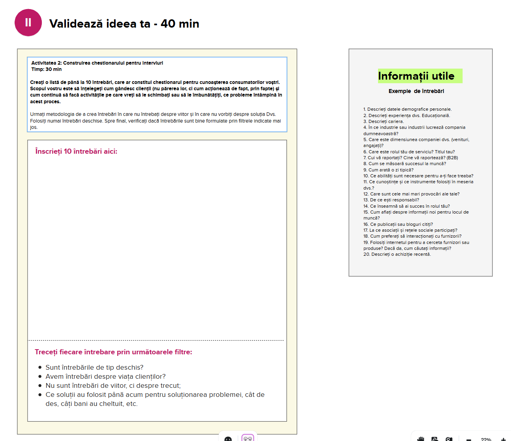

Prompt:
```
Am creat o listă de până la 10 întrebări pentru un chestionar de interviu, cu scopul de a înțelege cum gândesc clienții mei (nu părerea lor), cum acționează (prin fapte) și ce probleme întâmpină în legătură cu domeniul pe care îl investighez. Am încercat să urmez metodologia indicată, folosind întrebări deschise, axate pe trecut/prezent și pe client, nu pe soluția mea sau pe viitor.

Îți voi oferi:
Lista mea cu cele (până la) 10 întrebări pe care le-am formulat.

Te rog să evaluezi **fiecare întrebare** din lista mea, trecând-o prin următoarele filtre (criterii de evaluare), așa cum sunt specificate în exercițiu:

Criterii de evaluare (Filtre):
1.  **Întrebare de tip deschis?** (Permite un răspuns detaliat, nu doar "Da/Nu" sau un singur cuvânt?)
2.  **Se concentrează pe viața/experiența clientului?** (Este despre acțiunile, experiențele, problemele *lui*?)
3.  **Este despre trecut sau prezent?** (Se referă la cum a acționat sau acționează *acum* clientul? **NU** trebuie să fie despre viitor sau ipotetic.)
4.  **Evită să vorbească despre soluția mea?** (Întrebarea **NU** trebuie să descrie sau să întrebe despre soluția pe care o am eu în minte.)
5.  **Ajută la înțelegerea soluționării problemei în prezent?** (Întrebarea ajută să aflu *cum* rezolvă clientul problema acum, ce soluții a folosit, cât de des, ce costuri a implicat - bani, timp etc.?)

Feedback-ul tău ar trebui să includă:
*   O analiză **pentru fiecare întrebare** din lista mea, menționând dacă respectă sau nu fiecare dintre cele 5 filtre.
*   Identificarea clară a întrebărilor care **NU** respectă unul sau mai multe filtre și **explicația** pentru care nu le respectă.
*   Sugestii concrete pentru **reformularea** întrebărilor care nu sunt corecte, astfel încât să respecte filtrele.
*   O apreciere generală asupra listei de întrebări (dacă este bine direcționată spre scopul de a înțelege clientul și problema).

Te rog analizează și oferă feedback constructiv și detaliat pentru fiecare întrebare.
```
# Modulul 4
## Exercițiul 1: Schițare produs

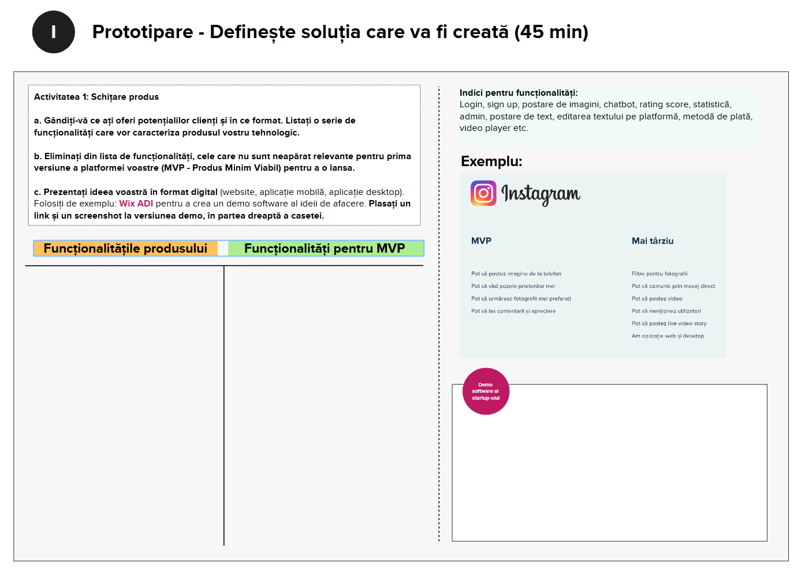

Prompt:
```
Am finalizat un exercițiu în care am definit soluția pe care vreau să o creez. Am listat întâi toate funcționalitățile pe care mi le imaginez pentru produsul meu tehnologic, apoi am selectat dintre acestea doar funcționalitățile esențiale pentru prima versiune (MVP - Produs Minim Viabil). De asemenea, am creat o prezentare digitală (demo) a ideii.

Îți voi oferi:
1.  **Lista mea de "Funcționalitățile produsului":** Toate caracteristicile pe care le-am identificat pentru produsul meu.
2.  **Lista mea de "Funcționalități pentru MVP":** Funcționalitățile selectate ca fiind esențiale pentru lansare.
3.  **(Opțional) Link sau descriere/screenshot** al demo-ului digital pe care l-am creat (conform cerinței c).

Te rog să evaluezi listele mele de funcționalități și selecția MVP, verificând următoarele aspecte:

Criterii de evaluare:
1.  **Generarea Listei Inițiale:**
    *   Am creat o listă de funcționalități în secțiunea "Funcționalitățile produsului"?
    *   Sunt aceste funcționalități relevante pentru ideea generală a produsului meu?
    *   Sunt formulate clar?
2.  **Selecția MVP:**
    *   Lista "Funcționalități pentru MVP" conține **doar** elemente care se regăsesc și în lista completă "Funcționalitățile produsului"? (Este un subset?)
    *   Selecția funcționalităților pentru MVP pare **logică** și **esențială**? Se concentrează pe rezolvarea problemei principale a clientului și pe livrarea propunerii unice de valoare?
    *   Sunt **eliminate** din MVP funcționalități care par a fi "nice-to-have" (bune de avut, dar nu critice pentru lansare)?
    *   Lista MVP pare suficient de **minimală** pentru a reprezenta o primă versiune (Produs Minim Viabil), dar suficient de **completă** pentru a fi utilă/testabilă?
3.  **Claritate:** Sunt funcționalitățile descrise clar în ambele liste?
4.  **(Bonus, dacă am oferit link/screenshot)** Prezentarea digitală (demo-ul) corespunde funcționalităților definite în MVP? *Notă: Evaluează doar dacă am furnizat informații despre demo.*

Feedback-ul tău ar trebui să includă:
*   Ce aspecte ale listelor și selecției MVP sunt bine realizate.
*   Ce funcționalități din MVP ar putea să nu fie strict esențiale și de ce.
*   Ce funcționalități esențiale ar putea lipsi din MVP (dacă este cazul).
*   Sugestii pentru o definire mai clară a funcționalităților, dacă este necesar.
*   Observații generale despre coerența între produsul imaginat și MVP-ul propus.

Te rog analizează și oferă feedback constructiv.
```


## Exercițiul 2: Modelul de venit al afacerii

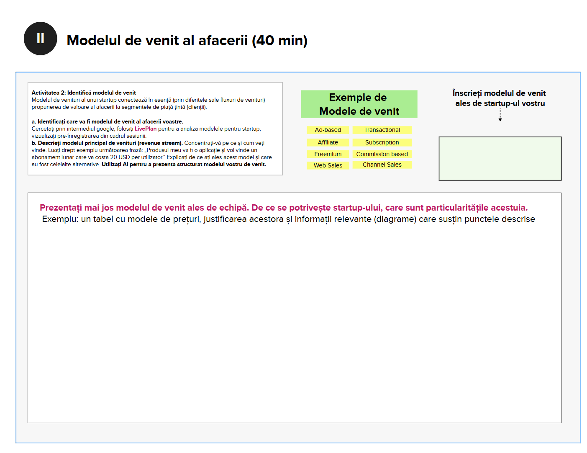

Prompt:
```
Am finalizat un exercițiu în care am identificat și descris modelul principal de venit (revenue stream) pentru startup-ul meu. Am ales un model și l-am prezentat mai detaliat, explicând cum vom face bani și de ce se potrivește acest model afacerii mele.

Îți voi oferi:
1.  **Numele modelului de venit** pe care l-am ales (textul din caseta "Înscrieți modelul de venit ales de startup-ul vostru").
2.  **Prezentarea detaliată a modelului de venit** ales (textul din zona de prezentare de mai jos), care poate include descrierea modului de funcționare, particularități, justificare, eventuale tabele de prețuri sau alte informații relevante.

Te rog să evaluezi munca mea și să îmi oferi feedback, verificând următoarele aspecte:

Criterii de evaluare:
1.  **Identificarea Modelului:**
    *   Am specificat clar numele modelului de venit ales? (Ex: Subscription, Freemium, Ad-based, Transactional, etc.)
    *   Este modelul ales unul potrivit pentru tipul de afacere/produs descris anterior?
2.  **Prezentarea Detaliată:**
    *   **Claritate:** Este descrierea modelului de venit clară și ușor de înțeles? Se înțelege exact cum intenționez să generez venit?
    *   **Justificare:** Am explicat *de ce* am ales acest model specific? Argumentele mele pentru potrivirea modelului cu startup-ul meu (produs, clienți, piață) sunt logice și convingătoare?
    *   **Particularități:** Am descris suficient de detaliat cum va funcționa modelul în cazul meu specific? (Ex: dacă e abonament - ce tipuri de abonamente, ce prețuri?; dacă e freemium - ce e gratuit, ce e plătit?; dacă e publicitate - cine sunt advertiserii, cum se integrează reclamele?)
    *   **Completitudine:** Am inclus elementele relevante pentru a descrie modelul (ex: posibil tabel de prețuri, dacă este cazul)?
    *   **Coerență:** Este modelul de venit coerent cu celelalte elemente ale afacerii mele definite anterior (Lean Canvas: Segmente de Clienți, Propunere Unică de Valoare, Soluție etc.)?
    *   **Realism:** Modelul de venit propus pare realist și sustenabil pentru tipul meu de startup?

Feedback-ul tău ar trebui să includă:
*   Ce aspecte ale identificării și prezentării modelului de venit sunt bine realizate.
*   Ce anume necesită îmbunătățiri (ex: justificarea alegerii este slabă, descrierea este neclară, lipsesc detalii importante despre prețuri/funcționare, modelul pare nerealist sau necoerent cu restul afacerii).
*   Sugestii specifice pentru a clarifica sau a îmbunătăți descrierea modelului de venit și justificarea acestuia.

Te rog analizează și oferă feedback constructiv.
```

# Modulul 5
## Exercițiul 1: UVP și identitatea vizuală

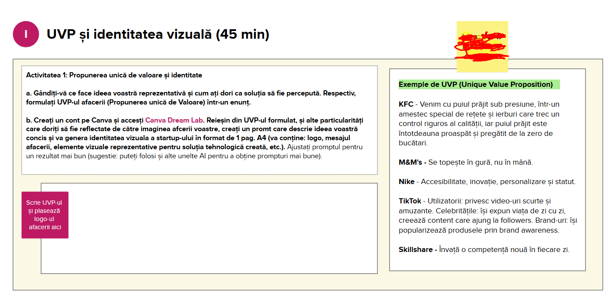

Prompt:
```
Am finalizat un exercițiu în care am formulat Propunerea Unică de Valoare (UVP) pentru afacerea mea sub forma unui enunț concis. De asemenea, am creat un prompt pentru o unealtă AI (cum ar fi Canva Dream Lab) pentru a genera o identitate vizuală (concept A4 cu logo, mesaj, elemente vizuale) care să reflecte UVP-ul și specificul afacerii mele.

Îți voi oferi:
1.  **Enunțul UVP** pe care l-am formulat (textul din caseta "Scrie UVP-ul...").
2.  **(Opțional) Logo-ul** generat sau o descriere a acestuia (dacă l-am plasat conform cerinței).
3.  **Prompt-ul** pe care l-am creat pentru generarea identității vizuale de către AI (conform cerinței b).

Te rog să evaluezi munca mea și să îmi oferi feedback, verificând următoarele aspecte:

**Evaluare pentru Propunerea Unică de Valoare (UVP - Enunțul):**
1.  **Claritate și Concizie:** Este UVP-ul formulat clar, ușor de înțeles și suficient de scurt (un enunț)?
2.  **Unicitate:** Subliniază UVP-ul ce face afacerea/produsul meu *diferit* sau special față de alternative?
3.  **Valoare:** Comunică UVP-ul principalul *beneficiu* sau valoare pentru segmentul de clienți vizat?
4.  **Relevanță:** Este UVP-ul aliniat cu problema pe care o rezolv, soluția oferită și clienții definiți anterior?
5.  **Credibilitate:** Pare promisiunea din UVP credibilă și realizabilă?

**Evaluare pentru Prompt-ul de Generare a Identității Vizuale (pentru AI):**
1.  **Completitudine:** Include prompt-ul elementele cheie menționate în cerință (referire la UVP, logo, mesajul afacerii, elemente vizuale reprezentative, format A4 etc.)?
2.  **Claritate:** Este prompt-ul formulat clar și specific, astfel încât o unealtă AI să poată înțelege ce se dorește?
3.  **Coerență:** Descrie prompt-ul o identitate vizuală care este *coerentă* cu UVP-ul formulat și cu specificul afacerii mele?
4.  **Specificitate:** Oferă prompt-ul suficiente detalii despre stilul vizual dorit, culori, atmosfera, etc., fără a fi însă prea restrictiv?

**Feedback General:**
*   Ce aspecte ale UVP-ului și ale prompt-ului pentru identitatea vizuală sunt bine realizate.
*   Ce anume necesită îmbunătățiri (ex: UVP-ul este prea generic, nu comunică valoarea clar; prompt-ul este vag, lipsesc elemente cheie, nu se leagă de UVP).
*   Sugestii specifice pentru a îmbunătăți formularea UVP-ului și/sau a prompt-ului pentru AI.
*   **(Dacă am oferit logo)** O scurtă apreciere dacă logo-ul pare să se potrivească cu UVP-ul și descrierea din prompt.

Te rog analizează și oferă feedback constructiv.
```

## Exercițiul 2: Lansarea afacerii pe piață

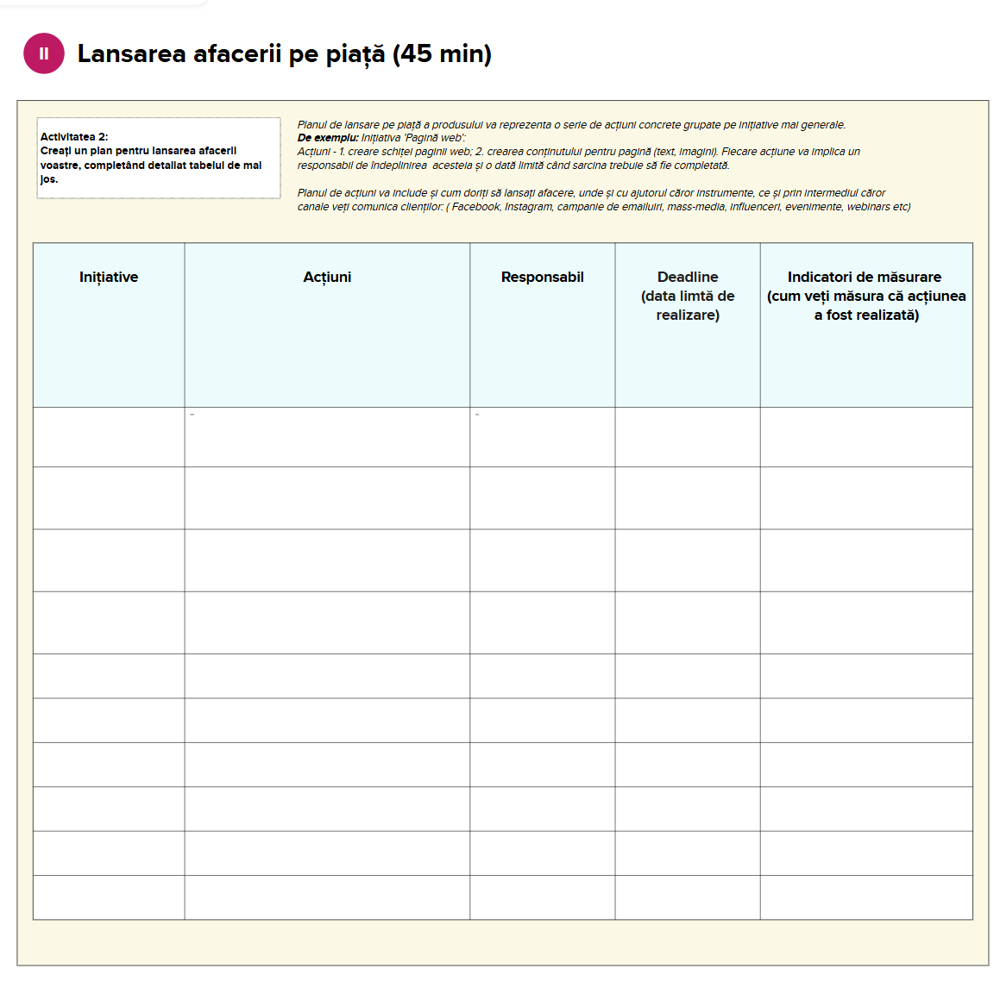

Prompt:
```
Am creat un plan pentru lansarea afacerii mele, completând un tabel care detaliază inițiativele majore, acțiunile specifice necesare, responsabilii, termenele limită și indicatorii de măsurare pentru succesul fiecărei acțiuni.

Îți voi oferi:
Tabelul completat cu planul meu de lansare (cu coloanele: Inițiative, Acțiuni, Responsabil, Deadline, Indicatori de măsurare).

Te rog să evaluezi planul meu de lansare și să îmi oferi feedback, verificând următoarele aspecte:

Criterii de evaluare:
1.  **Completitudine:** Sunt toate coloanele completate pentru fiecare rând (fiecare acțiune listată)? Am inclus suficiente inițiative și acțiuni pentru a acoperi principalele aspecte ale unei lansări?
2.  **Claritate și Specificitate:**
    *   **Inițiative:** Sunt inițiativele definite clar ca obiective/proiecte majore? (ex: "Creare website", "Campanie Marketing Inițială")
    *   **Acțiuni:** Sunt acțiunile descrise suficient de specific pentru a înțelege ce trebuie făcut? (ex: "Scriere text pagină 'Despre noi'" vs. "Creare conținut") Sunt ele concrete și realizabile?
    *   **Responsabil:** Este clar cine este responsabil pentru fiecare acțiune? (Poate fi un nume, rol, sau "echipa X").
    *   **Deadline:** Este specificat un termen limită clar (dată sau perioadă specifică)?
    *   **Indicatori de măsurare:** Sunt indicatorii clari, specifici și relevanți pentru acțiunea respectivă? Indică aceștia cum se va măsura dacă acțiunea a fost realizată cu succes? (ex: "Pagină web publicată" vs. "Website gata"). Sunt măsurabili?
3.  **Logica și Coerența:**
    *   **Legătura Inițiativă-Acțiune:** Acțiunile listate sub o inițiativă contribuie logic la realizarea acelei inițiative?
    *   **Secvențialitate (Implicită):** Termenele limită formează o secvență logică și realistă pentru o lansare?
    *   **Realism:** Planul în ansamblu pare realist pentru un startup (ținând cont de resurse probabile)?
4.  **Relevanță:** Inițiativele și acțiunile sunt relevante pentru lansarea *specifică* a produsului/serviciului meu, așa cum a fost definit în modulele anterioare?

Feedback-ul tău ar trebui să includă:
*   Ce aspecte ale planului de lansare sunt bine realizate (ex: acțiuni specifice, indicatori măsurabili, coerență bună).
*   Ce anume necesită îmbunătățiri (ex: acțiuni prea vagi, lipsa responsabilităților, deadline-uri nerealiste, indicatori neclari sau nemăsurabili, lipsa unor acțiuni/inițiative esențiale pentru lansare).
*   Sugestii specifice pentru a îmbunătăți claritatea, specificitatea, realismul sau relevanța planului.

Te rog analizează și oferă feedback constructiv.
```

# Modulul 6
## Exercițiul 1: Pitching

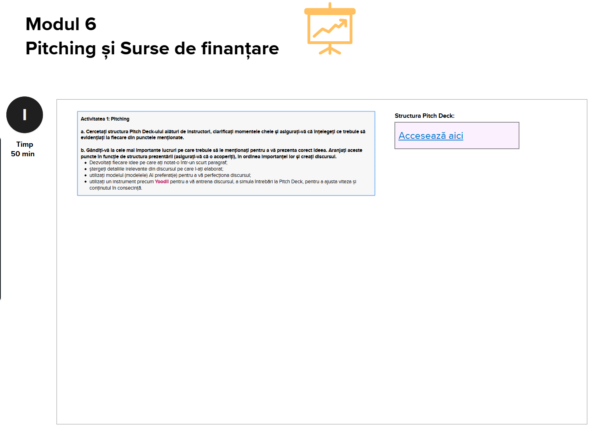

Prompt:
```
Am finalizat un exercițiu în care, după ce am înțeles structura unui Pitch Deck, am creat discursul (pitch-ul) pentru a prezenta ideea mea de afacere. Am încercat să aranjez punctele importante în ordinea corectă, să dezvolt fiecare idee într-un scurt paragraf și să elimin detaliile irelevante.

Îți voi oferi:
Textul pitch-ului meu (discursul pe care l-am creat conform pașilor din cerința b).

Te rog să evaluezi pitch-ul meu și să îmi oferi feedback, verificând următoarele aspecte:

Criterii de evaluare:
1.  **Structură Logică:** Urmează discursul o structură clară și logică, similară cu cea a unui pitch deck? (Ex: Introducere/Hook, Problemă, Soluție, Piață, Model de Venit, Echipă, Cerere/Ask - chiar dacă nu sunt toate explicit numite, fluxul trebuie să fie coerent).
2.  **Acoperirea Punctelor Cheie:** Sunt abordate elementele esențiale pentru o prezentare convingătoare a ideii (conform structurii relevante de pitch deck)? Include informații clare despre problemă, soluția propusă, propunerea unică de valoare (UVP), publicul țintă/piața? (Poate include și alte elemente relevante în funcție de context: echipă, tracțiune, model de venit, competiție, cererea specifică).
3.  **Claritate și Concizie:** Este mesajul transmis clar, direct și ușor de înțeles? Au fost eliminate eficient detaliile irelevante sau informațiile redundante, conform cerinței? Este limbajul folosit concis și la obiect?
4.  **Dezvoltarea Ideilor:** Sunt ideile principale suficient de dezvoltate (prezentate în paragrafe scurte, nu doar enumerate), oferind suficient context, dar fără a deveni excesiv de detaliate?
5.  **Impact și Persuasiune:** Este pitch-ul suficient de interesant și convingător? Reușește să capteze atenția, să evidențieze oportunitatea și să creeze încredere în idee/echipă?

Feedback-ul tău ar trebui să includă:
*   Ce aspecte ale pitch-ului sunt bine realizate (ex: structură clară, problemă bine definită, soluție convingătoare, concizie).
*   Ce anume necesită îmbunătățiri (ex: structură confuză, lipsa unor puncte cheie, prea multe detalii irelevante, idei insuficient dezvoltate, mesaj neclar sau neconvingător).
*   Sugestii specifice pentru a îmbunătăți structura, conținutul, claritatea sau impactul pitch-ului.

Te rog analizează și oferă feedback constructiv.
```

## Modulul 6, Exercițiul 2: Surse de finanțare

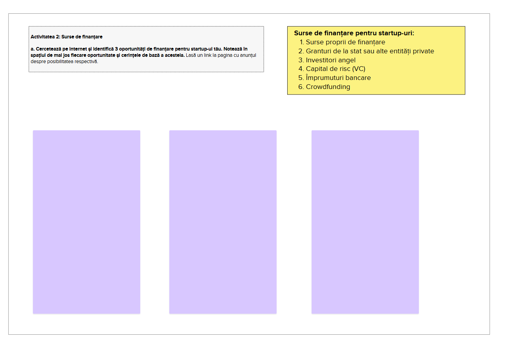

Prompt:
```
Am finalizat un exercițiu în care am cercetat și identificat 3 oportunități de finanțare care ar putea fi potrivite pentru startup-ul meu. Pentru fiecare oportunitate, am notat cerințele de bază și am inclus un link către pagina cu anunțul/detaliile respective.

Îți voi oferi:
Descrierea celor 3 oportunități de finanțare identificate, incluzând pentru fiecare:
1.  Numele/Tipul oportunității (ex: Grant Inovare XYZ, Runda de investiții ABC Angels, Platforma Crowdfunding DEF).
2.  Cerințele de bază pe care le-am identificat.
3.  Link-ul către pagina relevantă.

Te rog să evaluezi munca mea și să îmi oferi feedback, verificând următoarele aspecte:

Criterii de evaluare:
1.  **Numărul Oportunităților:** Am identificat exact 3 oportunități distincte de finanțare?
2.  **Relevanța Oportunităților:** Sunt oportunitățile identificate relevante pentru un startup, în special pentru tipul meu de afacere (dacă se poate deduce)? (Ex: Se încadrează în categoriile generale menționate - granturi, investitori, VC, crowdfunding, etc. - sau sunt surse specifice plauzibile?).
3.  **Identificarea Cerințelor:** Am notat cerințe de bază pentru *fiecare* dintre cele 3 oportunități? Sunt aceste cerințe formulate clar și par relevante pentru tipul respectiv de finanțare? (Ex: criterii de eligibilitate, documente necesare, stadiul startup-ului etc.).
4.  **Furnizarea Link-urilor:** Am inclus un link funcțional (sau cel puțin un URL care pare valid) pentru *fiecare* dintre cele 3 oportunități?
5.  **Claritatea Prezentării:** Sunt informațiile (numele oportunității, cerințele, link-ul) prezentate clar și organizat pentru fiecare dintre cele 3 cazuri?

Feedback-ul tău ar trebui să includă:
*   Confirmarea dacă am identificat 3 oportunități relevante și dacă am inclus cerințele și link-urile pentru fiecare.
*   Ce aspecte sunt bine realizate (ex: oportunități relevante, cerințe bine identificate).
*   Ce anume necesită îmbunătățiri (ex: lipsesc oportunități, lipsesc cerințe sau link-uri, oportunități irelevante, cerințe vagi).
*   Sugestii specifice pentru a completa sau clarifica informațiile prezentate.

Te rog analizează și oferă feedback constructiv.
```